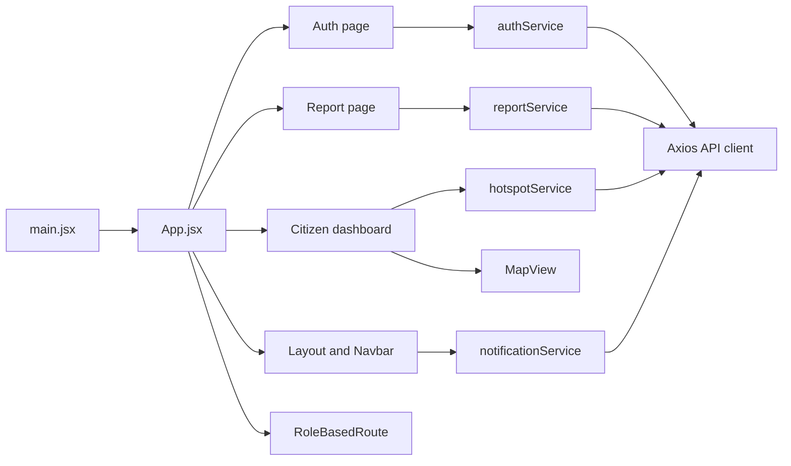

# Pravaah Web Application

This directory contains the React client for Pravaah. It is a Vite application that handles user authentication, role-based navigation, citizen reporting, map display, recent report browsing, notification UI, and offline report synchronization.

## Runtime

```bash
npm install
npm run dev
npm run build
npm run lint
npm run preview
```

Create `frontend/web_app/.env.local` from `.env.example`:

```env
VITE_API_BASE_URL=http://localhost:8000
VITE_ENVIRONMENT=development
```

The shared API client appends `/api` to `VITE_API_BASE_URL`.

## Application Flow



## Directory Overview

```text
src/
+-- assets/          Images and SVG assets used by the UI
+-- components/      Reusable and feature-specific interface components
+-- hooks/           Small custom React hooks
+-- pages/           Route-level screens
+-- services/        API-facing service modules
+-- utils/           Shared helpers, API client, auth utilities, and constants
+-- App.jsx          Route tree and auth state coordination
+-- main.jsx         React entry point
```

## Crucial Files

### `src/main.jsx`

This is the browser entry point. It imports global CSS, Leaflet CSS, and renders `<App />` inside `React.StrictMode`.

### `src/App.jsx`

`App.jsx` owns the top-level routing and authentication gate.

- Imports route pages, dashboards, shared layout, and auth helpers.
- Tracks whether auth has been checked and whether a valid token exists.
- Listens for `storage` and `authTokenChanged` events so login/logout changes update routing in the same tab and across tabs.
- Redirects `/` to the dashboard that matches the JWT role, or to `/auth` when no valid token exists.
- Protects dashboard, report, community, and profile routes with `RoleBasedRoute`.
- Renders `OfflineSync` for logged-in users so locally saved reports can be synchronized.

### `src/utils/api.js`

This file creates the shared Axios client.

- Builds the base URL from `VITE_API_BASE_URL` and appends `/api`.
- Adds the `Authorization: Bearer <token>` header when `authToken` is present in local storage.
- Handles `401` responses by clearing the token and returning the user to `/auth`.
- Normalizes common network and server errors into user-facing messages used by service modules.

### `src/utils/auth.js`

This module contains client-side JWT helpers for routing only.

- `decodeJWT` reads the JWT payload without verifying the signature.
- `getUserRole` and `getUserId` extract role and subject from the stored token.
- `hasRole` and `hasAnyRole` support route guards.
- `getDashboardRoute` maps `citizen`, `official`, and `analyst` roles to dashboard paths.
- `isTokenExpired` compares the token `exp` claim with the current browser time.

### `src/components/shared/RoleBasedRoute.jsx`

This wrapper protects role-specific routes.

- Redirects unauthenticated users to `/auth`.
- Redirects authenticated users with the wrong role to their own dashboard.
- Renders children only when the stored JWT role is allowed.

### `src/components/Layout/Layout.jsx`

Provides the common page frame. It renders the navbar once and uses React Router's `<Outlet />` for the active page content.

### `src/components/Layout/Navbar.jsx`

`Navbar.jsx` contains the primary navigation and notification dropdown.

- Reads the current role from `utils/auth` and builds role-aware navigation links.
- Loads notifications through `notificationService` and keeps a badge count.
- Polls for new notifications while the user is logged in.
- Provides sign-out by clearing `authToken` and redirecting to `/auth`.
- Handles notification actions such as verify, reject, safe, and not-safe.
- For safe/not-safe actions, it requests browser geolocation, posts a safety-circle payload through the shared API client, and dispatches an `addSafetyCircle` event for the map.

### `src/pages/Auth/Auth.jsx`

The authentication page manages sign-in and sign-up.

- Maintains the active tab, selected role, form state, validation errors, and visibility toggles.
- Sign-in validates required fields, calls `authService.login`, stores the JWT as `authToken`, emits auth change events, and routes through the app-level redirect.
- Sign-up validates required fields, calls `authService.register`, then attempts automatic login using the same credentials.
- Registration sends `full_name`, email, phone, password, and selected user type to the backend.
- Connection errors can open the `ConnectionTest` helper.

### `src/pages/Home/Home.jsx`

The citizen dashboard combines live location, report data, map visualization, and safety information.

- Loads report hotspots through `fetchHotspots`.
- Loads recent reports through `fetchRecentReports`.
- Requests browser geolocation, reverse-geocodes coordinates with OpenStreetMap Nominatim, and can continue watching the user's location.
- Renders `MapView` with the user's marker, hazard hotspots, and safety circles.
- Attempts to load persisted safety circles and also listens for local `addSafetyCircle` events from the navbar.
- Displays recent reports, a feed component, risk information, safety recommendations, and nearby safe-place cards.

### `src/components/MapView.jsx`

The Leaflet map wrapper.

- Configures Leaflet marker icons for Vite bundling.
- Uses OpenStreetMap tiles through `react-leaflet`.
- Re-centers the map when `center` or `zoom` props change.
- Renders regular markers for the user's location.
- Renders report hotspots as scaled `CircleMarker` layers based on confidence.
- Renders safety circles with their saved color and safe/unsafe status.

### `src/pages/Report/Report.jsx`

The citizen report form handles location, media evidence, voice evidence, and submission.

- Tracks incident type, description, images, videos, uploaded images, voice recording state, and GPS state.
- Requests and watches browser geolocation so reports include latitude and longitude.
- Lets users attach photos, videos, and a recorded audio blob.
- Uses `uploadProfilePicture` for image analysis/upload flow and can autofill hazard type and description when a result includes hazard metadata.
- On submit, validates GPS availability and calls `submitReport` with hazard type, description, media, audio, latitude, and longitude.
- Resets form state after a successful submission.

### `src/components/OfflineSync.jsx`

This component coordinates browser-side offline report recovery.

- Tracks `navigator.onLine` and listens for browser online/offline events.
- Reads locally saved reports from `localStorage`.
- Converts stored base64 media back into `File` objects.
- Re-submits unsynced reports to `/api/reports/submit` when the browser is online.
- Removes successfully synced local reports from `localStorage`.
- Shows a compact sync status indicator in the lower-right corner.

## Services

### `src/services/authService.js`

Wraps auth API calls.

- `register` maps the UI user type to the backend role and posts to `/auth/register`.
- `login` submits an OAuth2-compatible form payload to `/auth/login`.
- Both functions convert backend/network failures into clearer thrown errors for UI display.

### `src/services/reportService.js`

Handles report submission and report-form utilities.

- Maps UI incident labels to backend hazard enum values.
- Builds `FormData` with `user_hazard_type`, `user_description`, and `media_files`.
- Sends latitude and longitude in request headers, matching the backend endpoint.
- Saves reports into `localStorage` when the browser is offline or a network error occurs.
- Includes helpers for geolocation, validation, file size formatting, and media file validation.

### `src/services/hotspotService.js`

Fetches map/dashboard report data.

- `fetchHotspots` calls `/reports/hotspots` and normalizes confidence to `0..1`.
- `fetchRecentReports` calls `/reports/recent` and maps backend fields into card-friendly values.

### `src/services/notificationService.js`

Provides notification polling and action helpers.

- Polls `/notifications/count` and refreshes `/notifications/recent` when new items appear.
- Exposes listener registration methods used by the navbar.
- Provides helper calls for verify, deny, and test notification endpoints.

### `src/services/feedService.js`

Fetches feed data from feed endpoints and formats source, urgency, and sentiment display metadata.

### `src/services/userService.js`

Contains profile, stats, activity, report, badge, reward, and profile-picture upload calls.

## Components and Pages

- `src/components/Feed/Feed.jsx`: Loads and renders feed cards with refresh and loading states.
- `src/components/Feed/FeedCard.jsx`: Displays one feed item.
- `src/components/Notifications/NotificationCenter.jsx`: Standalone notification UI.
- `src/components/official/*`: Official dashboard and modal components.
- `src/components/analyst/AnalystDashboard.jsx`: Analyst dashboard screen.
- `src/components/OfflineReportForm.jsx`: Offline report form component.
- `src/components/ReportForm.jsx` and `ReportForm.css`: Alternate report-form component and styles.
- `src/components/SafetyStatusModal.jsx`: Modal for safety status interactions.
- `src/components/shared/Button.jsx`, `Card.jsx`, `Input.jsx`: Small reusable UI primitives.
- `src/components/shared/ConnectionTest.jsx`: Diagnostic UI for backend connectivity checks.
- `src/components/shared/RoleGuard.jsx`: Role-guard helper component.
- `src/pages/Community/Community.jsx`: Community page route.
- `src/pages/Profile/Profile.jsx`: User profile page route.
- `src/pages/*/index.js`: Barrel exports for page imports.

## Styling and Assets

- `src/index.css`: Tailwind and global CSS entry.
- `src/App.css`: App-level styles.
- `tailwind.config.js`: Tailwind content scanning and theme extension.
- `postcss.config.js`: PostCSS setup for Tailwind and Autoprefixer.
- `src/assets/`: Static images and SVGs used by the interface.

## Build Configuration

- `vite.config.js`: Vite and React plugin configuration.
- `eslint.config.js`: ESLint configuration for JavaScript and JSX.
- `package.json`: Runtime dependencies, dev dependencies, and npm scripts.
